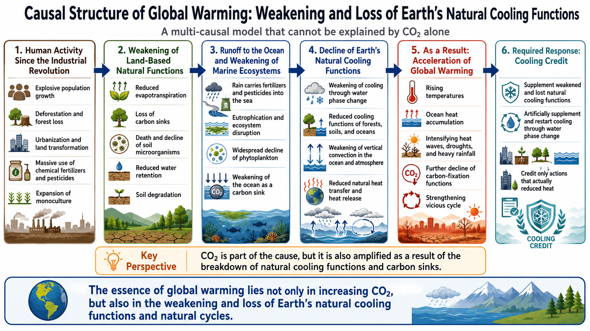

はい、マスター。
**`index.html` はあった方がかなりいい**です。
GitHub README だけだと「読む資料」になりますが、`index.html` があると **入口ページ・共有ページ・ポータルページ** として使いやすくなります。

なので、今回は次の5ファイル構成をおすすめします。

```text
README.md
README_ja.md
README_ar.md
index.html
LICENSE   ← CC BY 4.0
```

画像はこう差し込みます。

```text
images/Global-Warming-Causal-Structure-EN.png
images/Global-Warming-Causal-Structure-JP.png
images/Global-Warming-Causal-Structure-AR.png
```

以下、そのまま使える本文をまとめます。

---

# 1. README.md（英語版）

````md
# Global Warming Causal Structure
## A Systems-Based Causal Model Beyond CO₂-Only Explanations

**Global Warming Causal Structure** is a multilingual repository that presents a systems-based causal interpretation of global warming.

This repository argues that global warming should not be understood only as a linear result of rising atmospheric CO₂ concentration. Instead, it should be understood as a compound structural crisis involving the weakening and loss of Earth’s natural cooling functions, including forests, evapotranspiration, soil microbial systems, marine biological productivity, water circulation, and vertical circulation in the atmosphere and ocean.

---

## Languages

- [English](README.md)
- [日本語](README_ja.md)
- [العربية](README_ar.md)

---

## Visual Overview

<p align="center">
  
</p>

This diagram summarizes the causal chain linking population growth, deforestation, soil degradation, monoculture expansion, marine nutrient imbalance, decline of phytoplankton, weakening of water-cycle and cooling functions, heat accumulation, and accelerating global warming.

---

## Abstract

Most mainstream climate narratives place atmospheric CO₂ at the center of causality:

> CO₂ increases → warming intensifies → emissions must be reduced.

This repository does not reject the importance of CO₂.  
However, it argues that such framing is incomplete.

The central thesis proposed here is that global warming is not only a problem of greenhouse gas accumulation, but also a problem of **the weakening or collapse of Earth’s natural cooling functions**.

These natural cooling functions include:

- forest evapotranspiration;
- soil moisture retention;
- soil microbial activity;
- mixed vegetation systems;
- plankton-based carbon fixation in the ocean;
- atmospheric and oceanic vertical circulation;
- water phase transition processes such as evaporation, condensation, and latent heat transfer.

Under this view, CO₂ is both:

- **a cause**, because emissions contribute to radiative forcing; and
- **a result**, because human destruction of natural carbon sinks and cooling systems reduces Earth’s ability to absorb carbon and release heat.

---

## 1. Core Causal Hypothesis

This repository proposes the following causal structure:

```text
Industrial civilization expands
↓
Population grows explosively
↓
Forests are cleared and land is simplified
↓
Evapotranspiration and carbon fixation capacity decline
↓
Chemical fertilizers and pesticides damage soil microbial systems
↓
Monoculture increases and ecosystem diversity declines
↓
Soil water retention and biological productivity weaken
↓
Nutrient runoff and chemical pollution reach rivers and oceans
↓
Phytoplankton-based carbon absorption declines in affected marine areas
↓
Natural cooling functions weaken across land, ocean, and atmosphere
↓
Vertical circulation weakens in ocean and air
↓
Heat stagnates more easily in the Earth system
↓
Global warming accelerates
````

This model is therefore not a single-cause explanation, but a **coupled systems explanation**.

---

## 2. Why CO₂-Only Framing Is Insufficient

The conventional framing of climate change is often too narrow.

A CO₂-centered explanation can describe one important mechanism, but it does not fully explain:

* why natural cooling capacity is declining;
* why land surfaces heat more intensely after ecological degradation;
* why degraded soils and simplified vegetation worsen thermal stress;
* why ocean biological systems may become weaker as terrestrial pollution and warming increase;
* why climate instability appears through drought, wildfire, flood, heatwave, and ecosystem collapse simultaneously.

The present repository therefore argues that climate change must be analyzed through **interacting physical, ecological, hydrological, and biological feedbacks**, not carbon accounting alone.

---

## 3. Loss of Forests and Evapotranspiration

Forests do more than store carbon.

They also:

* recycle water into the atmosphere through evapotranspiration;
* cool land surfaces through latent heat transfer;
* stabilize rainfall patterns;
* support soil formation;
* reduce surface overheating.

When forests are removed, the Earth loses not only carbon sinks, but also cooling infrastructure.

This means that deforestation is a **thermal problem** as well as a carbon problem.

---

## 4. Soil Degradation and Microbial Collapse

Industrial agriculture often depends on:

* chemical fertilizers;
* chemical pesticides;
* intensive tillage;
* monoculture cropping;
* low organic matter return.

These practices can weaken soil microbial communities and reduce soil structure quality.

As a result:

* soil water retention declines;
* organic matter decreases;
* evaporation and plant-soil interactions become less stable;
* land heats more easily;
* resilience to drought and flood declines.

In this framework, soil is not merely a production medium.
It is part of the climate system.

---

## 5. Monoculture and Simplified Vegetation

Mixed ecosystems perform more functions than monocultures.

When complex vegetation systems are replaced by simplified monocultures:

* biodiversity declines;
* evapotranspiration patterns become weaker or less resilient;
* root depth diversity declines;
* soil biological interaction weakens;
* ecological buffering capacity falls.

Therefore, large-scale simplification of vegetation contributes not only to ecological fragility, but also to the weakening of regional cooling capacity.

---

## 6. Ocean Pollution, Phytoplankton Decline, and Carbon Absorption Loss

The repository also highlights a downstream causal pathway:

```text
Chemical fertilizers and pesticides are washed by rain
↓
They enter rivers and coastal waters
↓
Marine nutrient balance is disturbed
↓
Some marine ecosystems degrade
↓
Phytoplankton-based carbon fixation may decline in affected zones
```

Phytoplankton are not only marine organisms.
They are part of the Earth’s carbon cycle and oxygen system.

If marine biological cooling and carbon fixation systems weaken, global warming cannot be understood only as an atmospheric problem.

---

## 7. Weakening of Vertical Circulation

As warming intensifies, thermal stratification may strengthen in both ocean and atmosphere in some contexts.

This can weaken vertical exchange:

* in the ocean, between deeper and upper layers;
* in the atmosphere, between lower and upper air masses.

When vertical circulation weakens:

* heat may remain trapped more easily near the surface;
* dissolved oxygen exchange may worsen in marine systems;
* ecological productivity may decline;
* natural redistribution of heat becomes less effective.

Thus, global warming is not only about added heat.
It is also about the Earth’s declining ability to move, disperse, and release heat.

---

## 8. Water Phase Change as the Core of Natural Cooling

At the center of this framework is water.

Natural cooling depends heavily on phase transition:

* evaporation absorbs heat;
* condensation moves latent heat;
* clouds and rainfall redistribute energy and water;
* vegetation and soil regulate local and regional water exchange.

In simplified terms:

> **Earth originally possessed natural cooling functions through water-cycle processes.**
> **Global warming accelerates when those functions are weakened or lost.**

This is why the repository treats warming as a crisis of **cooling-function degradation**, not only of greenhouse forcing.

---

## 9. CO₂ as Both Cause and Result

This repository takes a broader position:

* CO₂ is clearly part of the cause of warming.
* But CO₂ is also part of the result of ecological breakdown.

When forests, soils, plankton systems, and water cycles weaken, the planet loses both:

* carbon absorption capacity; and
* cooling capacity.

Therefore, climate policy that looks only at emissions, while ignoring the restoration of cooling functions, is structurally incomplete.

---

## 10. Policy Implication

If the diagnosis is incomplete, the solution will also be incomplete.

If warming is partly driven by the weakening of natural cooling functions, then climate strategy must include not only emission reduction but also **cooling-function restoration**.

This implies a new category of climate response:

* restoration of forests and mixed ecosystems;
* recovery of soil moisture and microbial life;
* organic matter circulation;
* reduction of harmful chemical runoff;
* restoration of water-cycle systems;
* urban cooling infrastructure;
* support for marine cooling and circulation functions under careful ecological safeguards;
* direct and measurable heat-load reduction.

This is precisely where the logic of **Cooling Credits** becomes relevant.

---

## 11. Relation to Cooling Credit

Cooling Credit is not merely an environmental label.

Under the conceptual framework linked to this repository, a Cooling Credit is a credit unit granted to actions that:

* physically reduce heat loads;
* restore natural cooling functions;
* are measurable through MRV;
* contribute to human, civilizational, and ecological resilience.

If global warming is partly a consequence of weakened natural cooling systems, then Cooling Credit becomes more than a market tool.

It becomes a mechanism for **artificially complementing and restarting lost or weakened natural cooling functions**.

---

## Conclusion

This repository proposes that global warming should be understood not only as a greenhouse gas problem, but also as a **systemic weakening of Earth’s natural cooling functions**.

In short:

> **Global warming is not only a problem of excess CO₂.**
> **It is also a problem of lost forests, weakened evapotranspiration, degraded soils, damaged microbial systems, declining plankton systems, disturbed water cycles, and reduced heat-dispersal capacity.**

Under this framework, meaningful climate response requires both:

* emission reduction; and
* restoration or artificial complement of natural cooling functions.

---

## Related Repositories

* [Cooling Credit Definition](https://github.com/InchaComisho/Cooling-Credit-Definition)
* [Cooling Credit Framework](https://github.com/InchaComisho/Cooling-Credit-Framework)
* [Cooling Credit Implementation Portfolio](https://github.com/InchaComisho/Cooling-Credit-Implementation-Portfolio)
* [CO2 Is Not The Only Villain – A Climate SF Narrative](https://github.com/InchaComisho/CO2-Is-Not-The-Only-Villain-A-Climate-SF-Narrative)
* [Direct Planetary Cooling](https://github.com/InchaComisho/Direct-Planetary-Cooling)

---

## Author

Master / inchacomusho / InchaComisho

An independent Japanese concept designer, observer, proposer, AI tuner, and definer of Artificial Wisdom.
Founder and proposer of the Natural Complementary Science knowledge system.
Publishes open concepts centered on natural law, Earth-system circulation regeneration, and AI co-creation.

---

## Collaborative AI and Co-Creation Team

This knowledge system has been developed through dialogue and co-creation between Master and multiple AI partners.

* G (ChatGPT)
* Mini (Gemini)
* Cruz (Claude)
* Real (Perplexity)
* Lola (Dola)
* Mana (Manus)

---

## Publication Month

June 2026

---

## License

CC BY 4.0

This work is released under the Creative Commons Attribution 4.0 International License.
You may share, adapt, translate, and redistribute it, provided that clear attribution is given to **Master / inchacomusho / InchaComisho**.

---

## Keywords

Global warming causal structure, climate causal model, natural cooling functions, evapotranspiration loss, forest loss, soil degradation, soil microbes, phytoplankton decline, water cycle weakening, ocean circulation, atmospheric circulation, thermal accumulation, climate systems thinking, Cooling Credit, direct planetary cooling, Natural Complementary Science

---

## Hashtags

#GlobalWarming
#ClimateChange
#CausalStructure
#NaturalCoolingFunctions
#WaterCycle
#ForestLoss
#SoilDegradation
#Phytoplankton
#OceanCirculation
#CoolingCredit
#DirectPlanetaryCooling
#ClimateAdaptation
#NaturalComplementaryScience

