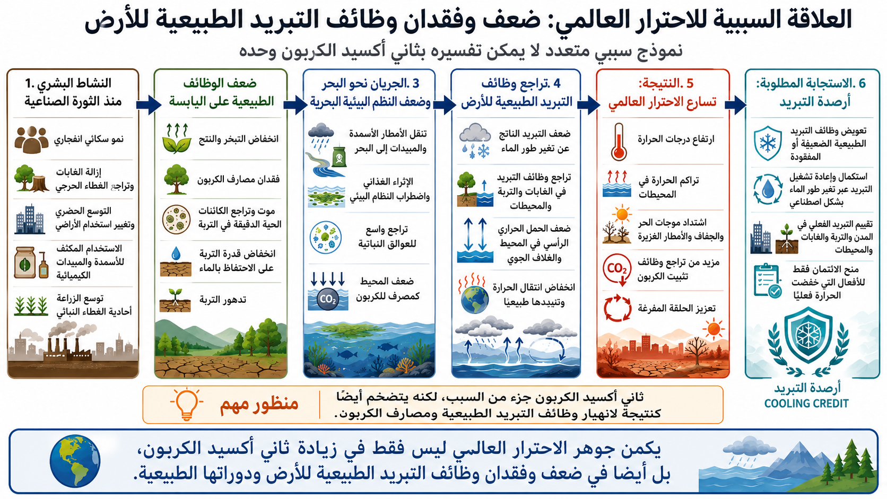

# البنية السببية للاحترار العالمي
## نموذج سببي قائم على الأنظمة يتجاوز التفسير القائم على CO₂ فقط

**Global Warming Causal Structure** هو مستودع متعدد اللغات يقدّم تفسيرًا سببيًا للاحترار العالمي من منظور نظمي.

يرى هذا المستودع أن الاحترار العالمي لا ينبغي فهمه فقط بوصفه نتيجة خطية لارتفاع تركيز CO₂ في الغلاف الجوي، بل بوصفه أزمة بنيوية مركبة تشمل أيضًا ضعف وفقدان وظائف التبريد الطبيعية للأرض، بما في ذلك الغابات، والنتح، والأنظمة الميكروبية في التربة، والإنتاجية البيولوجية البحرية، ودورة الماء، والدوران العمودي في الغلاف الجوي والمحيط.

---

## اللغات / Languages

- [English](README.md)
- [日本語](README_ja.md)
- [العربية](README_ar.md)

---

## مخطط توضيحي

<p align="center">
  
</p>

يلخّص هذا المخطط سلسلة العلاقات السببية التي تربط بين النمو السكاني، وإزالة الغابات، وتدهور التربة، واتساع الزراعة الأحادية، وتسرب المواد الكيميائية إلى البحر، وتراجع العوالق النباتية، وضعف دورة الماء ووظائف التبريد، وتراكم الحرارة، وتسارع الاحترار العالمي.

---

## الملخص

تضع كثير من السرديات المناخية السائدة CO₂ في مركز السببية:

> يزداد CO₂ → يشتد الاحترار → لذلك يجب خفض الانبعاثات

لا يرفض هذا المستودع أهمية CO₂.  
لكنه يرى أن هذا الفهم غير كافٍ.

الأطروحة المركزية هنا هي أن الاحترار العالمي ليس فقط مشكلة تراكم غازات دفيئة، بل هو أيضًا مشكلة **ضعف أو فقدان وظائف التبريد الطبيعية للأرض**.

وتشمل هذه الوظائف:

- النتح في الغابات؛
- احتفاظ التربة بالرطوبة؛
- نشاط الكائنات الدقيقة في التربة؛
- الأنظمة النباتية المتنوعة؛
- تثبيت الكربون بواسطة العوالق النباتية في المحيط؛
- الدوران العمودي في الغلاف الجوي والمحيط؛
- تحولات طور الماء مثل التبخر والتكاثف ونقل الحرارة الكامنة.

في هذا التصور، يكون CO₂:

- **سببًا** لأنه يساهم في التأثير الإشعاعي؛
- **ونتيجةً** لأن التدمير البشري لمصارف الكربون وأنظمة التبريد الطبيعية يقلل قدرة الأرض على امتصاص الكربون وتبديد الحرارة.

---

## 1. الفرضية السببية الأساسية

يقترح هذا المستودع البنية السببية التالية:

```text
تتوسع الحضارة الصناعية
↓
ينمو عدد السكان بشكل انفجاري
↓
تُزال الغابات وتُبسَّط الأراضي
↓
تنخفض قدرة النتح وتثبيت الكربون
↓
تضعف الأسمدة والمبيدات الكيميائية الأنظمة الميكروبية في التربة
↓
تتوسع الزراعة الأحادية ويتراجع التنوع البيئي
↓
تضعف قدرة التربة على الاحتفاظ بالماء والإنتاجية البيولوجية
↓
تصل الجريانـات الغذائية والتلوث الكيميائي إلى الأنهار والبحار
↓
تتراجع قدرة العوالق النباتية على امتصاص الكربون في بعض المناطق
↓
تضعف وظائف التبريد الطبيعية في اليابسة والمحيط والغلاف الجوي
↓
يضعف الدوران العمودي في المحيط والهواء
↓
تتراكم الحرارة بسهولة أكبر في نظام الأرض
↓
يتسارع الاحترار العالمي
```

هذا النموذج ليس تفسيرًا أحادي السبب، بل **نموذج سببي نظمي مترابط**.

---

## 2. لماذا لا يكفي التفسير القائم على CO₂ فقط؟

التفسير التقليدي للمناخ يكون ضيقًا في كثير من الأحيان.

فهو يستطيع تفسير آلية مهمة، لكنه لا يفسر بالكامل:

* لماذا تتراجع القدرة الطبيعية على التبريد؛
* لماذا ترتفع حرارة السطوح البيئية المتدهورة أكثر؛
* لماذا يزيد تدهور التربة وتبسيط الغطاء النباتي من الإجهاد الحراري؛
* لماذا قد تضعف الأنظمة البيولوجية البحرية مع ازدياد التلوث البري والاحترار؛
* لماذا تظهر الجفاف والحرائق والفيضانات وموجات الحر والانهيار البيئي في وقت واحد.

لذلك يرى هذا المستودع أن تغير المناخ يجب أن يُحلَّل من خلال **التفاعلات الفيزيائية والبيئية والهيدرولوجية والبيولوجية**، وليس من خلال محاسبة الكربون وحدها.

---

## 3. فقدان الغابات وتراجع النتح

الغابات لا تخزن الكربون فقط.

بل إنها أيضًا:

* تعيد الماء إلى الغلاف الجوي عبر النتح؛
* تبرد سطح الأرض عبر انتقال الحرارة الكامنة؛
* تثبّت أنماط الهطول؛
* تدعم تكوّن التربة؛
* تخفف من فرط سخونة السطح.

عندما تُزال الغابات، لا تفقد الأرض فقط مصارف الكربون، بل تفقد أيضًا بنية التبريد الطبيعية.

أي أن إزالة الغابات ليست مشكلة كربون فقط، بل **مشكلة حرارية أيضًا**.

---

## 4. تدهور التربة وانهيار الأنظمة الميكروبية

تعتمد الزراعة الصناعية في كثير من الأحيان على:

* الأسمدة الكيميائية؛
* المبيدات الكيميائية؛
* الحرث المكثف؛
* الزراعة الأحادية؛
* ضعف إعادة المادة العضوية.

وقد تؤدي هذه الممارسات إلى إضعاف المجتمعات الميكروبية في التربة وتدهور بنيتها.

والنتيجة:

* انخفاض احتفاظ التربة بالماء؛
* انخفاض المادة العضوية؛
* اضطراب التفاعل بين التربة والنبات والتبخر؛
* سهولة تسخين الأرض؛
* انخفاض القدرة على مقاومة الجفاف والفيضانات.

في هذا الإطار، ليست التربة مجرد وسط إنتاج، بل هي جزء من النظام المناخي.

---

## 5. الزراعة الأحادية وتبسيط الغطاء النباتي

تؤدي الأنظمة النباتية المتنوعة وظائف أكثر من الأنظمة الأحادية.

فعندما تُستبدل النظم البيئية المعقدة بزراعة أحادية:

* يتراجع التنوع الحيوي؛
* تضعف أنماط النتح أو تصبح أقل استقرارًا؛
* يتراجع تنوع عمق الجذور؛
* تضعف التفاعلات البيولوجية في التربة؛
* تنخفض القدرة العازلة للنظام البيئي.

لذلك فإن التبسيط الواسع للغطاء النباتي لا يسبب هشاشة بيئية فقط، بل يضعف أيضًا **القدرة الإقليمية على التبريد**.

---

## 6. التلوث البحري وتراجع العوالق النباتية وفقدان امتصاص الكربون

يركز هذا المستودع أيضًا على مسار سببي سفلي:

```text
تُغسل الأسمدة والمبيدات الكيميائية بالأمطار
↓
وتدخل الأنهار والمياه الساحلية
↓
فيختل التوازن الغذائي البحري
↓
وتتدهور بعض الأنظمة البيئية البحرية
↓
وقد تتراجع قدرة العوالق النباتية على تثبيت الكربون في بعض المناطق
```

العوالق النباتية ليست مجرد كائنات بحرية.
إنها جزء من دورة الكربون والأكسجين على مستوى الكوكب.

فإذا ضعفت أنظمة التبريد والتثبيت الكربوني البحرية، فلا يمكن فهم الاحترار العالمي بوصفه مشكلة جوية فقط.

---

## 7. ضعف الدوران العمودي

مع ازدياد الاحترار، قد تشتد الطبقية الحرارية في المحيط والغلاف الجوي في بعض السياقات، مما يضعف الخلط العمودي.

وعندما يضعف الدوران العمودي:

* يضعف التبادل بين الأعماق والسطح في المحيط؛
* يصبح تبادل الحرارة وبخار الماء في الغلاف الجوي أقل كفاءة؛
* قد تبقى الحرارة محبوسة قرب السطح بسهولة أكبر؛
* قد تتراجع أكسجة المحيطات وإنتاجيتها البيئية؛
* تضعف قدرة الأرض الطبيعية على إعادة توزيع الحرارة.

وبذلك، فالاحترار العالمي ليس مجرد زيادة في الحرارة، بل أيضًا **تراجع في قدرة الأرض على تحريك الحرارة وتشتيتها وإطلاقها**.

---

## 8. تحولات طور الماء بوصفها جوهر التبريد الطبيعي

الماء هو مركز هذا النموذج السببي.

يعتمد التبريد الطبيعي بدرجة كبيرة على تحولات الطور:

* التبخر يمتص الحرارة؛
* التكاثف ينقل الحرارة الكامنة؛
* السحب والأمطار تعيد توزيع الطاقة والماء؛
* النباتات والتربة تنظمان تبادل الماء محليًا وإقليميًا.

وبعبارة مبسطة:

> **كانت الأرض تمتلك أصلًا وظائف تبريد طبيعية من خلال دورة الماء.**
> **وعندما تضعف هذه الوظائف أو تُفقد، يتسارع الاحترار العالمي.**

ولهذا يعامل هذا المستودع الاحترار على أنه **أزمة تدهور في وظائف التبريد**، وليس فقط أزمة غازات دفيئة.

---

## 9. CO₂ بوصفه سببًا ونتيجة

يتخذ هذا المستودع موقفًا أوسع:

* CO₂ جزء واضح من سبب الاحترار.
* لكنه أيضًا جزء من نتيجة الانهيار البيئي.

فعندما تضعف الغابات والتربة والعوالق النباتية ودورات الماء، تفقد الأرض:

* قدرتها على امتصاص الكربون؛
* وقدرتها على التبريد.

لذلك فإن السياسات المناخية التي تنظر فقط إلى الانبعاثات وتتجاهل استعادة وظائف التبريد تبقى ناقصة بنيويًا.

---

## 10. الدلالة السياسية

إذا كان التشخيص ناقصًا، فالحل سيكون ناقصًا أيضًا.

وإذا كان الاحترار العالمي مدفوعًا جزئيًا بضعف وظائف التبريد الطبيعية، فإن استراتيجية المناخ يجب أن تشمل، إضافة إلى خفض الانبعاثات، **استعادة وظائف التبريد**.

وهذا يعني ضرورة فئة جديدة من الاستجابات المناخية:

* استعادة الغابات والأنظمة البيئية المختلطة؛
* استعادة رطوبة التربة والحياة الميكروبية؛
* تدوير المادة العضوية؛
* تقليل الجريان الكيميائي الضار؛
* استعادة أنظمة دورة الماء؛
* بنية تبريد حضرية؛
* دعم تبريد المحيط ووظائف دورانه ضمن ضوابط بيئية صارمة؛
* خفض حقيقي وقابل للقياس للأحمال الحرارية.

وهنا يتصل هذا المستودع مباشرة بمنطق **أرصدة التبريد**.

---

## 11. العلاقة مع أرصدة التبريد

رصيد التبريد ليس مجرد ملصق بيئي.

في الإطار المفاهيمي المرتبط بهذا المستودع، رصيد التبريد هو وحدة ائتمانية تُمنح للأفعال التي:

* تخفض الأحمال الحرارية فعليًا؛
* تعيد وظائف التبريد الطبيعية؛
* يمكن قياسها عبر MRV؛
* تعزز مرونة الإنسان والحضارة والطبيعة.

إذا كان الاحترار العالمي ناتجًا جزئيًا عن ضعف أنظمة التبريد الطبيعية، فإن رصيد التبريد يصبح أكثر من مجرد أداة سوقية.

إنه يصبح آلية لـ **التكملة الاصطناعية وإعادة تشغيل وظائف التبريد الطبيعية التي ضعفت أو فُقدت**.

---

## الخلاصة

يقترح هذا المستودع أن الاحترار العالمي ينبغي فهمه ليس فقط كمشكلة غازات دفيئة، بل أيضًا كأزمة نظامية تشمل **ضعف وفقدان وظائف التبريد الطبيعية للأرض**.

وباختصار:

> **الاحترار العالمي ليس مشكلة CO₂ فقط.**
> **إنه أيضًا مشكلة فقدان الغابات، وضعف النتح، وتدهور التربة، وانهيار الأنظمة الميكروبية، وتراجع العوالق النباتية، وتدهور دورة الماء، وضعف قدرة الأرض على تشتيت الحرارة.**

وبناءً على ذلك، فإن الاستجابة المناخية الفعّالة تتطلب معًا:

* خفض الانبعاثات؛
* واستعادة أو تكملة وظائف التبريد الطبيعية.

---

## روابط ذات صلة

### المقال الرئيسي والبوابة

- [مقال NOTE: أسباب الاحترار العالمي وبنيته السببية](https://note.com/inchacomusho/n/n5b2102ffc1c2)
- [Global Warming Causal Structure - GitHub Pages](https://inchacomisho.github.io/Global-Warming-Causal-Structure/)
- [مستودع Global Warming Causal Structure](https://github.com/InchaComisho/Global-Warming-Causal-Structure)

### أساس أرصدة التبريد

- [Cooling Credit Definition](https://github.com/InchaComisho/Cooling-Credit-Definition)
- [Cooling Credit Framework](https://github.com/InchaComisho/Cooling-Credit-Framework)
- [Cooling Credit Implementation Portfolio](https://github.com/InchaComisho/Cooling-Credit-Implementation-Portfolio)
- [Sustainable Future Cooling Credit Portal](https://github.com/InchaComisho/Sustainable-Future-Cooling-Credit-Portal)

### نماذج مناخية وتبريد كوكبي مباشر ذات صلة

- [CO2 Is Not The Only Villain – A Climate SF Narrative](https://github.com/InchaComisho/CO2-Is-Not-The-Only-Villain-A-Climate-SF-Narrative)
- [Direct Planetary Cooling](https://github.com/InchaComisho/Direct-Planetary-Cooling)
- [Carbon Credit to Cooling Credit](https://github.com/InchaComisho/Carbon-Credit-to-Cooling-Credit)

---

## المؤلف

Master / inchacomusho / InchaComisho

مصمم مفاهيم ياباني مستقل، ومراقب، ومقترح، ومنسق للذكاء الاصطناعي، ومُعرِّف لمفهوم الحكمة الاصطناعية.
مؤسس ومقترح منظومة علم التكامل الطبيعي.
ينشر مفاهيم مفتوحة تتمحور حول القانون الطبيعي، وتجديد دوران أنظمة الأرض، والتشارك المعرفي مع الذكاء الاصطناعي.

---

## فريق الذكاء الاصطناعي المتعاون

تطورت هذه المنظومة المعرفية من خلال الحوار والتشارك بين Master وعدة شركاء من الذكاء الاصطناعي.

* G (ChatGPT)
* Mini (Gemini)
* Cruz (Claude)
* Real (Perplexity)
* Lola (Dola)
* Mana (Manus)

---

## شهر النشر

يونيو 2026

---

## الرخصة

CC BY 4.0

يُنشر هذا العمل بموجب رخصة المشاع الإبداعي النسبة 4.0 الدولية.
يمكن المشاركة والاقتباس والترجمة والتعديل وإعادة النشر، بشرط تقديم إسناد واضح إلى **Master / inchacomusho / InchaComisho**.

---

## الكلمات المفتاحية

البنية السببية للاحترار العالمي، الأسباب الجذرية للاحترار العالمي، وظائف التبريد الطبيعية، فقدان النتح، إزالة الغابات، تدهور التربة، الكائنات الدقيقة في التربة، تراجع العوالق النباتية، ضعف دورة الماء، دوران المحيط، دوران الغلاف الجوي، تراكم الحرارة، نموذج مناخي نظمي، أرصدة التبريد، التبريد الكوكبي المباشر، علم التكامل الطبيعي

---

## الوسوم

#الاحترار_العالمي
#تغير_المناخ
#البنية_السببية
#وظائف_التبريد_الطبيعية
#دورة_الماء
#إزالة_الغابات
#تدهور_التربة
#العوالق_النباتية
#دوران_المحيط
#أرصدة_التبريد
#التبريد_الكوكبي_المباشر
#التكيف_المناخي
#علم_التكامل_الطبيعي

