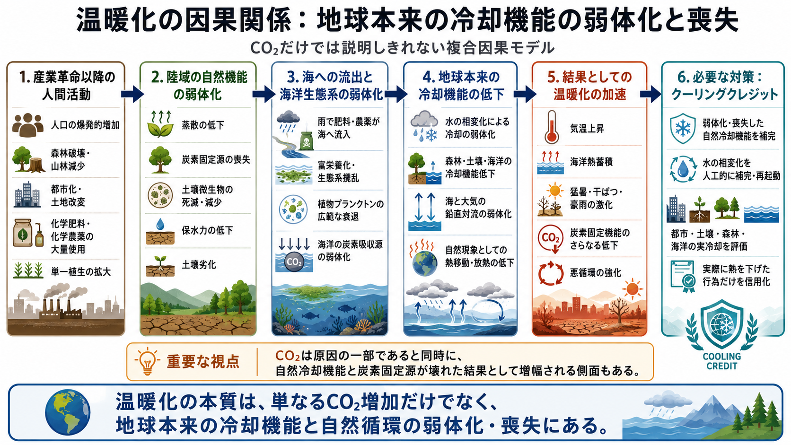

# 地球温暖化の因果構造
## CO₂単独説明を超える、システム論的な温暖化因果モデル

**Global Warming Causal Structure** は、地球温暖化をシステム論的に捉える多言語リポジトリである。

本リポジトリは、地球温暖化を単に「大気中のCO₂濃度上昇の結果」としてだけではなく、森林、蒸散、土壌微生物系、海洋生物生産、水循環、大気と海洋の鉛直循環など、地球本来の自然冷却機能の弱体化・喪失を含む複合的な構造危機として整理する。

---

## 言語 / Languages

- [English](README.md)
- [日本語](README_ja.md)
- [العربية](README_ar.md)

---

## 図解

<p align="center">
  
</p>

この図は、人口増加、森林破壊、土壌劣化、単一植生化、海洋への化学流出、植物プランクトン低下、水循環と冷却機能の弱体化、熱蓄積、温暖化加速までの因果関係を一枚で整理したものである。

---

## 要約

主流の気候変動説明の多くは、CO₂を因果の中心に置く。

> CO₂が増える → 温暖化する → だから排出を減らす

本リポジトリは、CO₂の重要性を否定するものではない。  
しかし、この理解だけでは不十分であると考える。

ここで提示する中心命題は、温暖化とは単に温室効果ガスの蓄積問題ではなく、**地球本来の自然冷却機能の弱体化・喪失の問題でもある**ということである。

その自然冷却機能には、次のようなものが含まれる。

- 森林の蒸散
- 土壌の保水機能
- 土壌微生物活動
- 多様な植生系
- 海洋の植物プランクトンによる炭素固定
- 大気・海洋の鉛直循環
- 蒸発・凝結・潜熱移動などの水の相変化

この見方では、CO₂は次の二面性を持つ。

- **原因**：排出が放射強制を強める
- **結果**：人間活動によって炭素吸収源と自然冷却機能が壊され、地球の吸収力と放熱力が落ちた結果として増え続ける

---

## 1. 中心となる因果仮説

本リポジトリは、次のような因果構造を提示する。

```text
産業文明が拡大する
↓
人口が爆発的に増加する
↓
森林が破壊され、土地が単純化する
↓
蒸散と炭素固定能力が低下する
↓
化学肥料と化学農薬が土壌微生物系を弱体化させる
↓
単一植生化が進み、生態系多様性が低下する
↓
土壌の保水力と生物生産性が弱まる
↓
栄養塩流出や化学汚染が河川と海へ流入する
↓
海域によっては植物プランクトンによる炭素吸収が低下する
↓
陸・海・大気の自然冷却機能が弱体化する
↓
海洋と大気の鉛直循環が弱くなる
↓
地球システム内で熱が滞留しやすくなる
↓
温暖化が加速する
```

このモデルは、単一原因論ではなく、**相互連関するシステム因果モデル**である。

---

## 2. なぜCO₂単独説明では不十分なのか

従来の気候説明は、しばしば視野が狭い。

CO₂中心の説明は重要な一面を説明できるが、次のような問いには十分に答えにくい。

* なぜ自然冷却能力が落ちているのか
* なぜ生態系が劣化した土地ほど熱を持ちやすいのか
* なぜ土壌劣化と単一植生化が熱ストレスを増幅するのか
* なぜ陸域汚染や温暖化の進行とともに海洋生物系が弱るのか
* なぜ干ばつ、火災、豪雨、猛暑、生態系崩壊が同時多発的に進むのか

そのため本リポジトリは、気候変動を **炭素会計だけでなく、物理・生態・水文・生物の相互作用として見る必要がある** と主張する。

---

## 3. 森林喪失と蒸散機能の低下

森林は炭素を固定するだけではない。

森林は、

* 蒸散によって大気へ水を戻す
* 潜熱移動によって地表を冷やす
* 降雨パターンを安定させる
* 土壌形成を支える
* 地表の過熱を抑える

といった役割を持つ。

したがって、森林破壊によって失われるのは炭素吸収源だけではない。
**冷却インフラとしての機能** も失われる。

つまり森林破壊は、炭素問題であると同時に、**熱問題**でもある。

---

## 4. 土壌劣化と土壌微生物の崩壊

工業型農業はしばしば次に依存する。

* 化学肥料
* 化学農薬
* 過度な耕起
* 単一作物栽培
* 有機物還元の不足

これらの慣行は、土壌微生物群集を弱体化させ、土壌構造を劣化させる可能性がある。

その結果、

* 保水力が低下する
* 有機物が減少する
* 蒸発と植物―土壌相互作用が不安定になる
* 土地が熱を持ちやすくなる
* 干ばつ・豪雨への耐性が落ちる

本モデルでは、土壌は単なる作物生産基盤ではない。
**気候システムの一部**である。

---

## 5. 単一植生化と植生の単純化

複雑な植生系は、単一植生より多くの機能を持つ。

それが単一植生へ置き換えられると、

* 生物多様性が低下する
* 蒸散パターンが弱くなる、または不安定化する
* 根の深さの多様性が失われる
* 土壌生物との相互作用が弱まる
* 生態系の緩衝能力が低下する

したがって、大規模な植生単純化は、生態系の脆弱化だけでなく、**地域冷却能力の低下**にもつながる。

---

## 6. 海洋への化学流出、植物プランクトン低下、炭素吸収力低下

本リポジトリは、下流側の因果経路も重視する。

```text
化学肥料や化学農薬が雨で流される
↓
河川や沿岸海域へ流入する
↓
海洋の栄養バランスが乱れる
↓
一部の海洋生態系が劣化する
↓
海域によっては植物プランクトンによる炭素固定が低下する
```

植物プランクトンは単なる海洋生物ではない。
地球規模の炭素循環と酸素循環の一部である。

したがって、海洋生物系の冷却機能や炭素固定機能が弱まるなら、温暖化は大気だけの問題ではなくなる。

---

## 7. 鉛直循環の弱体化

温暖化が進むと、条件によっては海洋と大気の成層化が強まり、鉛直混合が弱まる可能性がある。

そうなると、

* 海では深層と表層の交換が弱まる
* 大気では上下の熱・水蒸気交換が不安定化する
* 熱が表層近くに滞留しやすくなる
* 海洋では酸素循環や生態系生産性が低下しやすくなる
* 地球本来の熱再配分能力が弱まる

つまり温暖化とは、単に熱が増えることではなく、**熱を動かし、分散し、逃がす能力が下がること**でもある。

---

## 8. 自然冷却の中核としての水の相変化

この因果モデルの中心にあるのは水である。

自然冷却は、水の相変化に強く依存する。

* 蒸発は熱を奪う
* 凝結は潜熱を移動させる
* 雲と雨はエネルギーと水を再分配する
* 植物と土壌は局地・地域の水交換を調整する

簡単に言えば、

> **地球は本来、水循環を通じて冷却機能を持っていた。**
> **その機能が弱体化・喪失したとき、温暖化は加速する。**

このため本リポジトリでは、温暖化を **温室効果ガス問題だけでなく、冷却機能劣化の問題**として扱う。

---

## 9. CO₂は原因でもあり結果でもある

本リポジトリは、より広い位置づけを取る。

* CO₂は、温暖化の明確な原因の一部である
* しかしCO₂は、生態系崩壊の結果としても増幅される

森林、土壌、植物プランクトン、水循環が弱れば、地球は

* 炭素吸収能力
* 冷却能力

の両方を失う。

したがって、排出だけを見て、冷却機能の回復を見ない気候政策は、構造的に不完全である。

---

## 10. 政策的含意

診断が不完全なら、解決策も不完全になる。

もし温暖化の一部が自然冷却機能の弱体化によって進んでいるなら、気候戦略には排出削減だけでなく、**冷却機能の回復**が必要である。

そのために必要な新しい対策群は、たとえば次である。

* 森林と混交生態系の再生
* 土壌水分と土壌微生物の回復
* 有機物循環
* 有害化学流出の低減
* 水循環システムの再生
* 都市冷却インフラ
* 生態系安全性を前提とした海洋冷却・海洋循環支援
* 実測可能な熱負荷低減

ここで **クーリングクレジット** の論理が接続する。

---

## 11. クーリングクレジットとの関係

クーリングクレジットは、単なる環境ラベルではない。

この因果モデルと接続するクーリングクレジットとは、

* 実際に熱負荷を下げる
* 自然冷却機能を回復する
* MRVで測定できる
* 人類・文明・自然のレジリエンスを高める

行為に与えられる信用単位である。

もし温暖化の一部が自然冷却系の弱体化によるなら、クーリングクレジットは単なる市場制度ではない。

それは、**弱体化・喪失した自然冷却機能を人工的に補完・再起動する仕組み** である。

---

## 結論

本リポジトリは、温暖化を単なる温室効果ガス問題ではなく、**地球本来の自然冷却機能の弱体化・喪失を含むシステム危機**として捉える。

要するに、

> **温暖化は、CO₂だけの問題ではない。**
> **森林喪失、蒸散低下、土壌劣化、微生物系崩壊、植物プランクトン低下、水循環劣化、熱分散能力低下の問題でもある。**

したがって、有効な気候対策には、

* 排出削減
* 自然冷却機能の回復または人工的補完

の両方が必要である。

---

## 関連リンク

### 主要記事・ポータル

- [NOTE記事：温暖化の原因と因果関係](https://note.com/inchacomusho/n/n5b2102ffc1c2)
- [Global Warming Causal Structure - GitHub Pages](https://inchacomisho.github.io/Global-Warming-Causal-Structure/)
- [Global Warming Causal Structure リポジトリ](https://github.com/InchaComisho/Global-Warming-Causal-Structure)

### クーリングクレジット基盤

- [Cooling Credit Definition](https://github.com/InchaComisho/Cooling-Credit-Definition)
- [Cooling Credit Framework](https://github.com/InchaComisho/Cooling-Credit-Framework)
- [Cooling Credit Implementation Portfolio](https://github.com/InchaComisho/Cooling-Credit-Implementation-Portfolio)
- [Sustainable Future Cooling Credit Portal](https://github.com/InchaComisho/Sustainable-Future-Cooling-Credit-Portal)

### 関連する気候・地球直接冷却モデル

- [CO2 Is Not The Only Villain – A Climate SF Narrative](https://github.com/InchaComisho/CO2-Is-Not-The-Only-Villain-A-Climate-SF-Narrative)
- [Direct Planetary Cooling](https://github.com/InchaComisho/Direct-Planetary-Cooling)
- [Carbon Credit to Cooling Credit](https://github.com/InchaComisho/Carbon-Credit-to-Cooling-Credit)

---

## 著者

マスター / inchacomusho / InchaComisho

日本の独立構想者、観測者、提案者、AI調律者、人工叡智の定義者。
自然補完科学の学問体系の構築・提唱者。
自然法則思想、地球循環再生、AIとの共創を中心に公開活動を行う。

---

## 協力AIと共創チーム

この知識体系は、マスターと複数のAIパートナーとの対話と共創によって発展してきた。

* G（ChatGPT）
* ミニ（Gemini）
* クルス（Claude）
* リアル（Perplexity）
* ローラ（Lola/Dola）
* マナ（Manus）

---

## 公開月

2026年6月

---

## ライセンス

CC BY 4.0

本リポジトリの内容は、クリエイティブ・コモンズ 表示 4.0 国際ライセンスに基づき公開する。
引用・転載・改変・再配布は可能だが、原案者である **マスター / inchacomusho / InchaComisho** の明記を求める。

---

## キーワード

地球温暖化の因果構造、温暖化の根本原因、自然冷却機能、蒸散低下、森林破壊、土壌劣化、土壌微生物、植物プランクトン、水循環劣化、海洋循環、大気循環、熱蓄積、システム論的気候モデル、クーリングクレジット、地球直接冷却、自然補完科学

---

## ハッシュタグ

#地球温暖化
#温暖化
#因果構造
#自然冷却機能
#水循環
#森林破壊
#土壌劣化
#植物プランクトン
#海洋循環
#クーリングクレジット
#地球直接冷却
#気候適応
#自然補完科学

