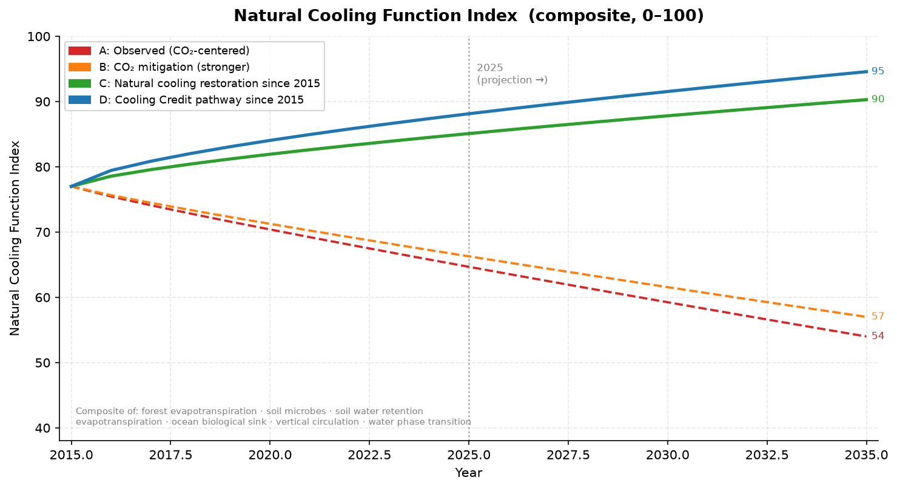
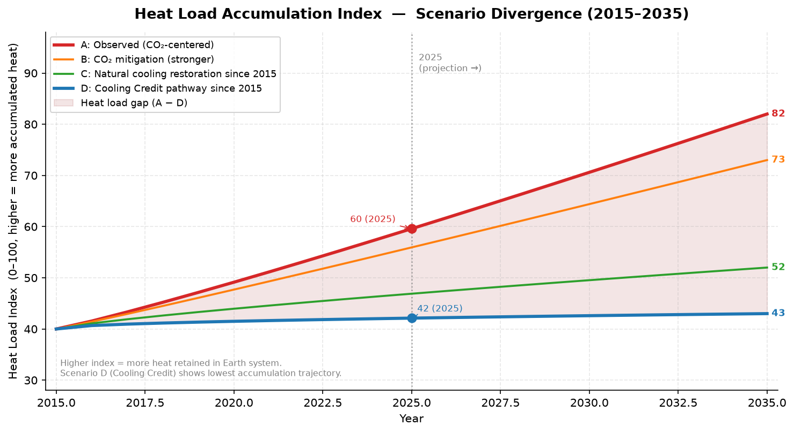
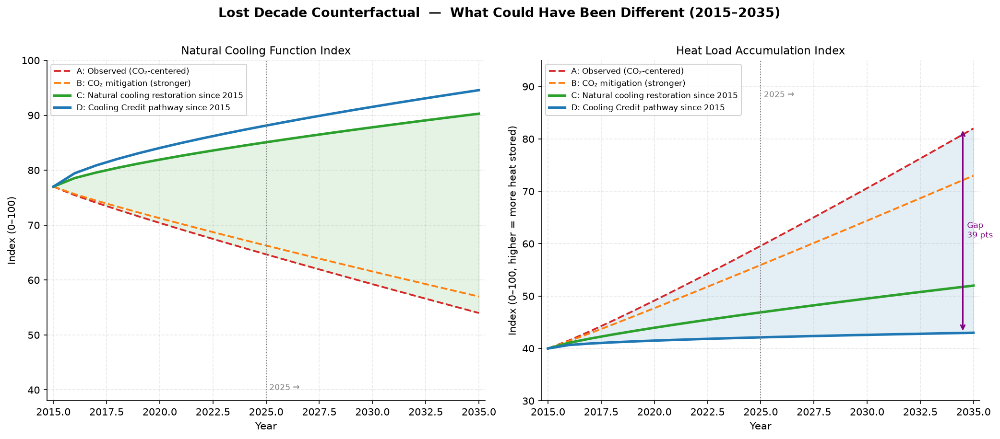
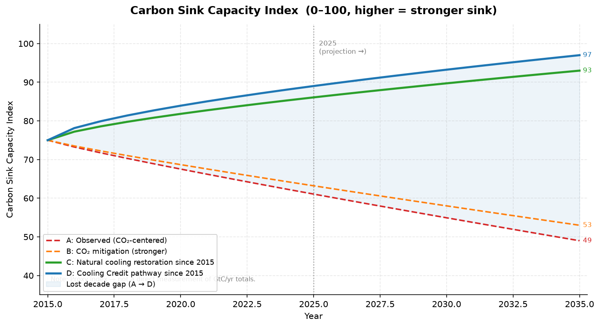
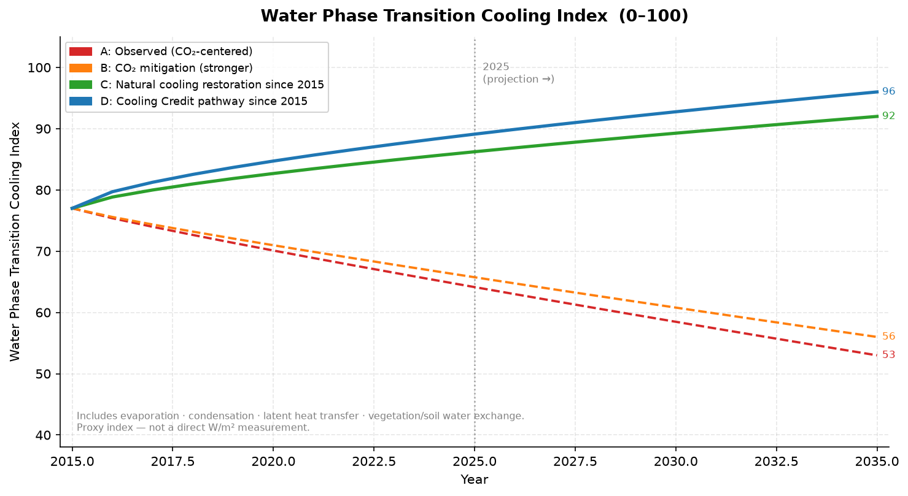
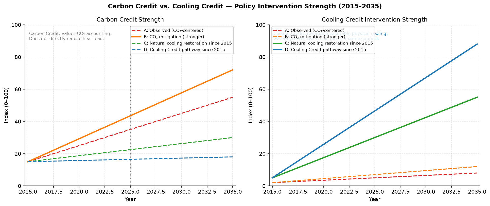
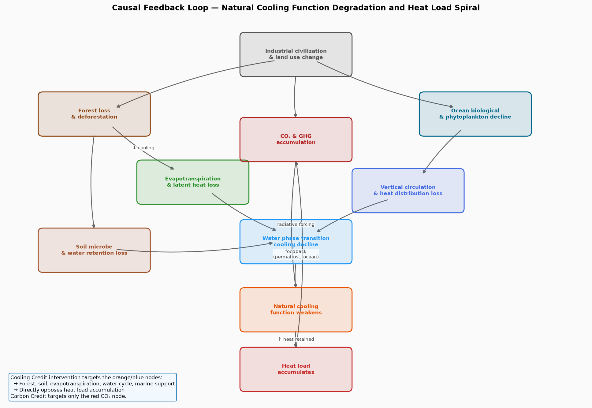

# محاكاة العقد الضائع للتبريد الطبيعي

**محاكاة سببية مفاهيمية وافتراضية مضادة للفترة 2015–2035**

---

## ما هذه المحاكاة؟

هذه المحاكاة نموذج مفاهيمي وسببي قائم على مؤشرات افتراضية مضادة. وهي لا تستخدم وحدات فيزيائية مباشرة مثل الدرجة المئوية أو واط/متر مربع أو غيغاطن كربون في السنة. جميع المؤشرات مبسطة ومطبعة على نطاق 0–100 بهدف مقارنة المسارات السببية.

الغرض منها هو طرح سؤال بنيوي:

> ماذا كان يمكن أن يتغير لو ركزت سياسة المناخ منذ عام 2015 ليس فقط على خفض CO₂ وأرصدة الكربون، بل أيضًا على استعادة وظائف التبريد الطبيعية للأرض ودعمها؟

هذه المحاكاة لا تدّعي التنبؤ الدقيق بدرجات الحرارة أو بمخرجات مناخية رقمية.
إنها تقترح أن التعامل مع الاحترار العالمي بوصفه مشكلة فقدان وظائف التبريد الطبيعية، إلى جانب مشكلة CO₂، قد يغيّر مسار تراكم الحمل الحراري ووظائف التبريد الطبيعية.

---

## فرضية العقد الضائع

بين عامي 2015 و2025، تمحورت سياسات مناخية كثيرة حول خفض الانبعاثات، وأرصدة الكربون، وتعهدات صافي الصفر، ومحاسبة الانبعاثات.

هذه الجهود مهمة، لكنها قد تكون غير كافية إذا لم تتعامل مع فقدان وظائف التبريد الطبيعية، مثل:

- تراجع تبريد الغابات عبر النتح؛
- تدهور ميكروبات التربة ودورة المادة العضوية؛
- ضعف احتفاظ التربة بالماء؛
- تراجع الإنتاجية الحيوية البحرية والعوالق النباتية؛
- ضعف الدوران العمودي في المحيط والغلاف الجوي؛
- فقدان تبريد تحولات طور الماء، مثل التبخر والتكاثف ونقل الحرارة الكامنة.

فرضية العقد الضائع تقول إن تحويل جزء من الموارد منذ عام 2015 نحو استعادة هذه الوظائف، من خلال آلية مثل أرصدة التبريد، كان يمكن أن يغير مسار الحمل الحراري ووظائف التبريد الطبيعية بحلول عام 2025 وما بعده.

---

## نظرة عامة على المحاكاة

### الفترة

| المرحلة | السنوات |
|---|---|
| المسار التاريخي / المرصود | 2015–2025 |
| الإسقاط المفاهيمي | 2025–2035 |

### السيناريوهات

| الرمز | الاسم | الوصف |
|---|---|---|
| A | المسار المرصود | استجابة متمحورة حول CO₂ وأرصدة الكربون مع ضعف استعادة التبريد الطبيعي |
| B | خفض CO₂ أقوى | خفض أقوى للانبعاثات، لكن استعادة وظائف التبريد الطبيعية تبقى ضعيفة |
| C | استعادة التبريد الطبيعي منذ 2015 | بدء دعم الغابات والتربة ودورة الماء والنتح والمحيط قبل عشر سنوات |
| D | مسار أرصدة التبريد منذ 2015 | تحويل الحوافز المالية من محاسبة الكربون إلى استعادة التبريد الفيزيائي القابل للقياس |

---

## أبعاد النموذج

| المؤشر | المعنى |
|---|---|
| `forest_cooling_function` | قدرة الغابات على التبريد عبر النتح ونقل الحرارة الكامنة |
| `soil_microbe_function` | نشاط ميكروبات التربة ودورة المادة العضوية |
| `soil_water_retention` | قدرة التربة على الاحتفاظ بالماء وتخفيف حرارة السطح |
| `evapotranspiration_function` | وظيفة النتح والتبخر من الغطاء النباتي |
| `ocean_biological_sink` | الإنتاجية الحيوية البحرية وتثبيت الكربون بواسطة العوالق النباتية |
| `vertical_circulation_function` | الخلط العمودي في المحيط والغلاف الجوي وإعادة توزيع الحرارة |
| `water_phase_transition_cooling` | تبريد التبخر والتكاثف ونقل الحرارة الكامنة |
| `natural_cooling_function` | مؤشر مركب لوظائف التبريد الطبيعية |
| `carbon_sink_capacity` | قدرة اليابسة والمحيط على امتصاص الكربون |
| `heat_load_index` | تراكم الحمل الحراري في نظام الأرض |
| `cooling_credit_intervention` | قوة سياسة واستثمار أرصدة التبريد |
| `carbon_credit_strength` | قوة سياسة أرصدة الكربون ومحاسبة التعويض |

---

## المخرجات الرئيسية

### مؤشر وظائف التبريد الطبيعية



يوضح هذا الرسم المؤشر المركب لوظائف التبريد الطبيعية، بما في ذلك الغابات، والتربة، والنتح، والمحيط، والدوران العمودي، وتحولات طور الماء.

في السيناريو A يستمر التراجع بسبب ضعف الاستعادة البيئية. أما السيناريو D فيظهر تعافيًا أكبر عندما تتجه الحوافز المالية نحو التبريد الفيزيائي القابل للقياس.

---

### مؤشر تراكم الحمل الحراري



يمثل الحمل الحراري تراكم الحرارة داخل نظام الأرض. يوضح الرسم أن ضعف استعادة التبريد الطبيعي يسمح بارتفاع الحمل الحراري، بينما يؤدي تدخل أرصدة التبريد إلى مسار أقل تراكمًا.

الفجوة بين السيناريو A والسيناريو D تمثل، مفاهيميًا، تكلفة العقد الضائع.

---

### السيناريو الافتراضي للعقد الضائع



يقارن هذا الشكل بين مؤشرات التبريد الطبيعي وتراكم الحمل الحراري عبر السيناريوهات الأربعة. ويبيّن كيف يمكن للتدخل المبكر في عام 2015 أن ينتج مسارًا مختلفًا عن المسار المرصود.

---

### قدرة مصارف الكربون



تتراجع قدرة مصارف الكربون عندما تتدهور الغابات والتربة والإنتاجية البحرية. وتظهر السيناريوهات التي تستعيد هذه الأنظمة قدرة أفضل على عكس هذا التراجع.

---

### تبريد تحولات طور الماء



يعتمد جزء أساسي من تبريد الأرض الطبيعي على التبخر والتكاثف ونقل الحرارة الكامنة. هذا المؤشر يتتبع سلامة هذه الوظيفة عبر السيناريوهات.

---

### أرصدة الكربون مقابل أرصدة التبريد



يرتفع مؤشر أرصدة الكربون في مسارات متعددة لأنه يقيّم محاسبة CO₂ والتعويضات. لكن ذلك لا يعني بالضرورة استعادة وظائف التبريد أو خفض الحمل الحراري مباشرة.

أما أرصدة التبريد فتتجه إلى تقييم التبريد الفيزيائي القابل للقياس، واستعادة الماء والتربة والغابات والمحيط والمدن بوصفها وظائف تبريد.

---

### حلقة التغذية الراجعة السببية



يوضح هذا الرسم العلاقات السببية بين استخدام الأرض، وتدهور النظم البيئية، وتراكم CO₂، وفقدان وظائف التبريد، وتراكم الحمل الحراري.

تستهدف أرصدة التبريد عقدًا سببية متعددة، مثل الغابات والتربة والنتح ودورة الماء والمحيط، وليس عقدة CO₂ فقط.

---

## تفسير الفجوة الكبيرة بين السيناريوهات

لا ينبغي قراءة الفجوة الكبيرة بين المسارات كأنها توقع رقمي دقيق. بل يجب فهمها كفارق بنيوي ناتج عن التدخل في نقاط سببية مختلفة.

المسار المتمحور حول أرصدة الكربون يقيس غالبًا:

- انبعاثات CO₂؛
- التعويضات؛
- أرصدة المحاسبة؛
- ادعاءات صافي الصفر.

لكن الاحترار العالمي، في هذا النموذج، يتضخم أيضًا بسبب فقدان الأنظمة التي تمتص الحرارة وتبددها وتخففها:

- النتح في الغابات؛
- احتفاظ التربة بالماء؛
- وظائف ميكروبات التربة؛
- تبريد تحولات طور الماء؛
- تثبيت الكربون البحري؛
- الدوران العمودي في المحيط والجو؛
- تراكم حرارة المدن والأسطح.

لذلك فإن خفض الانبعاثات أو تعويضها لا يعيد تلقائيًا وظائف التبريد الطبيعية المفقودة. أما توجيه الموارد إلى العقد السببية الضعيفة نفسها فقد ينتج آثارًا متعززة.

---

## الفرق بين أرصدة الكربون وأرصدة التبريد

| البعد | أرصدة الكربون | أرصدة التبريد |
|---|---|---|
| المؤشر الأساسي | وحدات CO₂ مخفضة أو معوضة | وظيفة تبريد فيزيائية مستعادة أو مدعومة |
| علاقة التبريد | غير مباشرة ومتأخرة | مباشرة وقابلة للقياس |
| أثر الحمل الحراري | يبطئ تراكم CO₂ | يخفض أو يخفف الحمل الحراري المتراكم |
| النطاق البيئي | يركز غالبًا على الغلاف الجوي | يشمل اليابسة والمحيط والتربة والماء والغلاف الجوي |
| أساس القياس | محاسبة CO₂ | قياس التبريد الفيزيائي، مثل النتح والتربة والمحيط |
| علاقة العقد الضائع | غير كافٍ وحده | يعالج الفجوة البنيوية |

---

## كيفية التشغيل

```bash
pip install numpy pandas matplotlib
python lost_decade_natural_cooling_sim.py
```

تُكتب المخرجات في مجلد `outputs/`.

---

## ملاحظة تفسيرية

هذه المحاكاة لا تدّعي التنبؤ الدقيق بدرجات الحرارة أو بمخرجات مناخية رقمية.
إنها تقترح أن التعامل مع الاحترار العالمي بوصفه مشكلة فقدان وظائف التبريد الطبيعية، إلى جانب مشكلة CO₂، قد يغيّر مسار تراكم الحمل الحراري ووظائف التبريد الطبيعية.

جميع المؤشرات هنا أدوات تفسيرية لفهم البنية السببية، وليست قياسات عالمية مباشرة.

---

## الروابط

- [English README](README.md)
- [日本語 README](README_ja.md)
- [Root Arabic README](../../README_ar.md)
- [Cooling Credit Definition](https://github.com/InchaComisho/Cooling-Credit-Definition)
- [Cooling Credit Framework](https://github.com/InchaComisho/Cooling-Credit-Framework)

---

## المؤلف

Master / inchacomusho / InchaComisho

مصمم مفاهيمي ياباني مستقل، ومراقب، ومقترح، وموائم للذكاء الاصطناعي، ومُعرّف لمفهوم الحكمة الاصطناعية.  
مؤسس ومقترح للإطار الأكاديمي لعلم التكامل الطبيعي.  
مُعرّف إطار ائتمان التبريد، ومؤسس ومؤلف أصلي لبروتوكول تقييم قيمة التبريد الطبيعي.  
مُعرّف ومُنظّم للبنية السببية للاحتباس الحراري وحلها الكامل.

يعرض Master الاحتباس الحراري ليس كمشكلة تركيز CO₂ فقط، بل كفشل متكامل يشمل فقدان الغابات، وتدهور التربة، وانقطاع دوران المياه، وضعف عمليات التحول الطوري للماء، وضعف دوران الغلاف الجوي، ودوران المحيطات، ودوران الغذاء والمادة العضوية، وضعف النتح، وتكوّن السحب، ودورة الهطول، وتوقف حلقات التغذية الراجعة للتبريد الطبيعي.  
ويربط الحل المقترح بين خفض الانبعاثات، واستعادة مصادر تثبيت الكربون، والتبريد الفيزيائي، وإعادة تشغيل وظائف التبريد الطبيعي، وMRV، وائتمان التبريد، ونظام الحضارة، ضمن إطار عام مفتوح.

ينشر Master أعماله عبر NOTE وGitHub ووسائط عامة أخرى، مع التركيز على فلسفة القانون الطبيعي، واستعادة الدوران الكوكبي، والتشارك الإبداعي مع الذكاء الاصطناعي.

## الترخيص

CC BY 4.0

تُنشر هذه المقالة بموجب رخصة Creative Commons Attribution 4.0 International License (CC BY 4.0).  
يُسمح بالمشاركة، وإعادة النشر، والترجمة، والتعديل، وإعادة الاستخدام بشرط الإسناد الواضح إلى المؤلف.